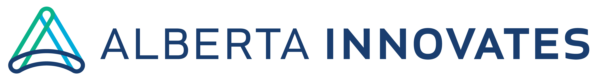
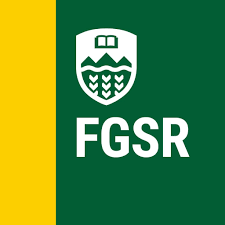
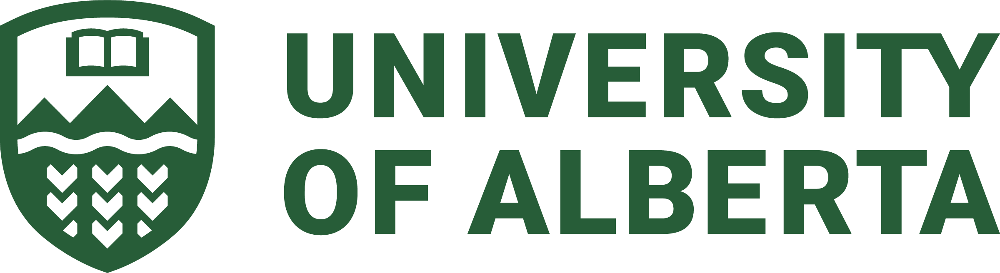
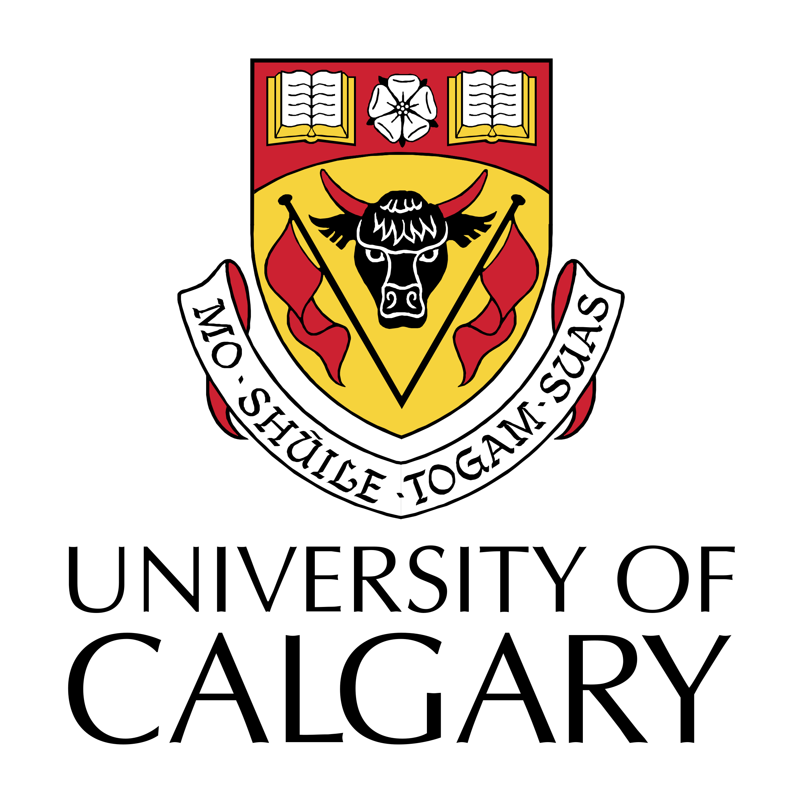

# 2022 Quanta Student Symposium

# About
The Quanta Student Symposium is a meeting of six quantum-focused research groups at the Universities of Alberta and Calgary. This symposium provides training to our student members in emerging quantum technologies; promotes professional development; develops the network of quantum personnel within Alberta; and finally, provides networking and instructions from industry representatives of Canadian and Alberta quantum technology companies. With the training and experience gained in the Quanta program and symposium, we anticipate our members being leaders and key players in the future of Alberta’s quantum industry.

## Venue
The symposium will take place at Lister Hall on the University of Alberta campus

# Schedule

How do I dropdown?

 
This is how you dropdown.

# Posters

# Sponsors

