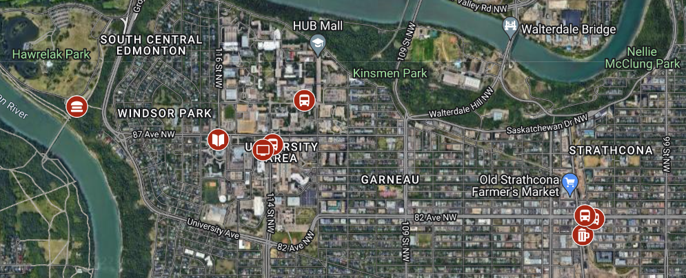

# 2022 Quanta CREATE Student Symposium

# :bulb: About
The Quanta Student Symposium is a meeting of six quantum-focused research groups at the Universities of Alberta and Calgary, and is an essential component of the [Quanta CREATE program](https://www.ualberta.ca/science/programs/create/quanta/index.html). 

This symposium provides training to our student members in emerging quantum technologies; promotes professional development; develops the network of quantum personnel within Alberta; and finally, provides networking and instructions from industry representatives of Canadian and Alberta quantum technology companies. 

With the training and experience gained in the Quanta program and symposia, our members will become leaders and key players in the future of Alberta’s quantum industry.

 

# :hotel: Venue
The scientific program will take place in the Maple Leaf Room at Lister Centre on the University of Alberta campus, just minutes from Edmonton's River Valley - the largest urban park in Canada.

<table>
  <tr>
    <td></td>
    <td></td>
  </tr>
  <tr>
    <td>
	
Lister Centre, Conference Services.
</td>
    <td>
Edmonton River Valley
</td>
  </tr>
 </table>

## :iphone: WiFi Connection
Guest internet access is available either through the secure Eduroam service, or using the open Wi-Fi network “Guest@UofA”. Please note that the guest network requires a browser login and registration for internet access.

The Eduroam service must be registered for in advance through your home academic institution:
* [University of Calgary instructions](https://ucalgary.service-now.com/it?id=kb_article&sys_id=63817562138272008246f7b2e144b055)
* [University of Alberta instructions](https://uofaprod.service-now.com/sp?id=kb_article&sys_id=ba9ca2e44f88c6008a3b00fe9310c7cc)

## :earth_americas: Map of Events

	
	 
	(Click for interactive)

## :bus: Transportation
For participants traveling from Calgary, a bus will be provided for the departing and returning trips. The bus will depart from the [University of Calgary ICT Loop](https://goo.gl/maps/7PctRe4R8RuevnWR8) on Sunday August 7th at 1200 noon **sharp**.

The return trip will leave from Lister Centre on Tuesday August 9th at 18:30.

 

# :watch: Schedule
The syposium will take place over three days from August 7-9, 2022. A PDF of the meeting brochure can be downloaded [here](https://drive.google.com/file/d/1Nc6h9io3vuWGb79PW2iQkGQnONnoXb6p/view?usp=sharing). All times are given in MDT.

<h2>Day 1: Sunday, Aug. 7th</h2>

 
<table>
<thead>
  <tr>
    <th> </th>
    <th>Description</th>
  </tr>
</thead>
<tbody>
  <tr>
    <td>12:00 - 16:00</td>
    <td>:oncoming_bus: Travel from Calgary to Edmonton & check in
	 
	<ul>
	  <li>Bus leaves at 12:00 from <a href="https://www.google.com/maps/place/ICT+Loop/@51.0808638,-114.1314406,18.48z/data=!4m13!1m7!3m6!1s0x53716f0eed856cbd:0x4388e12c6196ef4d!2sTrailer+D+-+H,+622+Collegiate+Pl+NW,+Calgary,+AB+T2N+4V8!3b1!8m2!3d51.0809732!4d-114.132306!3m4!1s0x53716f0e97c2ebe5:0x63d5535efac0c0f2!8m2!3d51.080702!4d-114.130745">ICT Loop, 622 Collegiate Pl NW, Calgary, AB T2N 4V8</a></li>
	  <li>Check in: 1-042 Lister Centre (From the front doors, go down the stairs and turn left. The Front Desk is on the left.)</li>
	</ul></td>
  </tr>
  <tr>
    <td>17:00 - 20:00</td>
    <td>:beers: Welcoming Reception (<a href="#beers-welcoming-reception">Details below</a>)   <ul><li>MKT Fresh Food | Beer Market, <a href="https://www.google.com/maps/place/8101+Gateway+Blvd+NW,+Edmonton,+AB+T6E+3X8/@53.5169833,-113.4945116,17z/data=!3m1!4b1!4m5!3m4!1s0x53a0220f00fd4775:0xc83848078540686a!8m2!3d53.5169833!4d-113.4945116">8101 Gateway Blvd NW, Edmonton, AB T6E 3X8</a></li></ul></td>
  </tr>
</tbody>
</table>

<h2>Day 2: Monday, Aug. 8th</h2>

 
<table>
<thead>
  <tr>
    <th> </th>
    <th>Description</th>
  </tr>
</thead>
<tbody>
  <tr>
    <td>07:30 - 08:30</td>
    <td>:banana: Breakfast   <ul><li>Lister Centre, Maple Leaf Room</li></ul></td>
  </tr>
  <tr>
    <td>08:30 - 08:45</td>
    <td>:microphone: Welcoming/Administrative Remarks</td>
  </tr>
  <tr>
    <td>08:45 - 09:00</td>
    <td>:red_circle: Opening Remarks: <b>John Davis</b>, University of Alberta</td>
  </tr>
  <tr>
    <td></td>
    <td></td>
  </tr>
  <tr>
    <td>09:00 - 10:00</td>
    <td>:red_circle: Invited Talk: <b>Shabir Barzanjeh</b> University of Calgary, Institute for Quantum Science and Technology</td>
  </tr>
  <tr>
    <td>10:00 - 10:20</td>
    <td>:large_blue_circle: Contributed Talk: <b>Natalia Carvalho</b>  “<em>Low temperature optomechanics</em>”</td>
  </tr>
  <tr>
    <td>10:20 - 10:40</td>
    <td>:large_blue_circle: Contributed Talk: <b>Clinton Potts</b>   “<em>Dynamical Backaction Magnomechanics</em>”</td>
  </tr>
  <tr>
    <td>10:40 - 11:00</td>
    <td>:large_blue_circle: Contributed Talk: <b>Prasoon Shandilya</b>   “<em>Optomechanical spin-photon interface in diamond</em>”</td>
  </tr
  <tr>
    <td></td>
    <td></td>
  </tr>
  <tr>
    <td>11:00 - 11:15</td>
    <td>:coffee: Coffee Break</td>
  </tr
  <tr>
    <td></td>
    <td></td>
  </tr>
  <tr>
    <td>11:15 - 12:15</td>
    <td>:red_circle: Invited Talk: <b>Hugh Ramp</b>, D-Wave Systems Inc.  “<em>An Introduction to the D-Wave Quantum Annealing Hardware</em>”</td>
  </tr>
  <tr>
    <td>12:15 - 12:35</td>
    <td>:large_blue_circle: Contributed Talk: <b>Marvin Hirschel</b> “<em>Superfluid Helium Gravitational wave/Dark Matter Detector</em>”</td>
  </tr>
  <tr>
    <td>12:35 - 12:55</td>
    <td>:large_blue_circle: Contributed Talk: <b>Pramodh Senarath Yapa</b>  “<em>Theory of a 2D Spatially-Modulated Phase in Superfluid Helium-3 under Confinement</em>”</td>
  </tr>
  <tr>
    <td>12:55 - 13:15</td>
    <td>:large_blue_circle: Contributed Talk: <b>Rishabh</b> “<em>Quantum Neuroscience: Radical pair mechanism may explain hypomagnetic field effects on neurogenesis</em>”</td>
  </tr>
  <tr>
    <td></td>
    <td></td>
  </tr>
  <tr>
    <td>13:15 - 13:20</td>
    <td>:microphone: Administrative Remarks</td>
  </tr>
  <tr>
    <td>13:20 - 14:15</td>
    <td>:spaghetti: Lunch</td>
  </tr>
  <tr>
    <td></td>
    <td></td>
  </tr>
  <tr>
    <td>14:15 - 16:30</td>
    <td>:computer: Quantum Computing Challenges & Exploration (<a href="#computer-quantum-computing-challenges-and-exploration">Details below<a>)
	 
	<ul>
	  <li>Edmonton Clinic Health Academy (ECHA), <a href="https://www.google.com/maps/dir/53.5225719,-113.5307178/53.5223385,-113.5265275/@53.5217565,-113.5298011,461m/data=!3m2!1e3!5s0x53a021f5aa466997:0xd87592711e9f08bc!4m9!4m8!1m5!3m4!1m2!1d-113.5299863!2d53.5223115!3s0x53a021f494ee05f5:0xa9750cb62b6c60e2!1m0!3e2">11405 87 Ave NW, Edmonton, AB T6G 1C9</a> (<b>L1-270 computer lab</b>)</li>
	</ul></td>
  </tr>
  <tr>
    <td>16:30 - 18:30</td>
    <td>:pushpin: Poster Session (<a href="#trophy-posters">Details below</a>)   <ul><li>Lister Centre, Aurora Room</li></ul></td>
  </tr>
  <tr>
    <td>18:30 - 21:00</td>
    <td> :hamburger: Networking BBQ & Group Picture (<a href="#hamburger-networking-bbq">Details below</a>)   <ul><li>Hawrelak Park, <a href="https://www.google.com/maps/dir/53.5225719,-113.5307178/53.5244075,-113.5448453/@53.5245207,-113.541961,990m/data=!3m2!1e3!5s0x53a021f5aa466997:0xd87592711e9f08bc!4m2!4m1!3e2">9330 Groat Rd NW, Edmonton, AB T6G 2A8</a> (<b>Site #2</b>) </li></ul></td>
  </tr>
</tbody>
</table>

<h2>Day 3: Tuesday, Aug. 9th</h2>

 
<table>
<thead>
  <tr>
    <th> </th>
    <th>Description</th>
  </tr>
</thead>
<tbody>
  <tr>
    <td>07:30 - 08:30</td>
    <td>:pineapple: Breakfast   <ul><li>Lister Centre, Maple Leaf Room</li></ul></td>
  </tr>
  <tr>
    <td>08:30 - 08:40</td>
    <td>:microphone: Administrative Remarks</td>
  </tr>
  <tr>
    <td></td>
    <td></td>
  </tr>
    <tr>
    <td>08:40 - 08:55</td>
    <td>:red_circle: Invited Talk: <b>Crys Vanier</b>, Alberta Innovates</td>
  </tr>
  <tr>
    <td>09:00 - 10:00</td>
    <td>:red_circle: Invited Talk: <b>Rafal Janik</b>, Xanadu Quantum Technologies</td>
  </tr>
  <tr>
    <td>10:00 - 10:20</td>
    <td>:red_circle: Invited Talk: <b>Alexis Milinusic</b>, Government of Alberta, Director of Technology Relations  “<em>Alberta technology and innovation strategy (ATIS): strengthening Alberta’s technology and innovation sector</em>”</td>
  </tr>
  <tr>
    <td>10:20 - 10:40</td>
    <td>:large_blue_circle: Contributed Talk: <b>Snehasis Addy</b>   “<em>Information reconciliation in quantum key distribution</em>”</td>
  </tr>
  <tr>
    <td>10:40 - 11:00</td>
    <td>:large_blue_circle: Contributed Talk: <b>Logan Cooke</b>   “<em>Holonomic quantum computing in ultracold neutral atoms via Floquet engineering</em>”</td>
  </tr
  <tr>
    <td></td>
    <td></td>
  </tr>
  <tr>
    <td>11:00 - 11:15</td>
    <td>:coffee: Coffee Break</td>
  </tr
  <tr>
    <td></td>
    <td></td>
  </tr>
  <tr>
    <td>11:15 - 12:15</td>
    <td>:red_circle: Invited Talk: <b>Daniel Higgenbottom</b>, Photonic Inc.</td>
  </tr>
  <tr>
    <td>12:15 - 12:35</td>
    <td>:large_blue_circle: Contributed Talk: <b>Leli Esmaeilifar</b> “<em>Multipartite time-bin GHz-state generation in a photonic system</em>”</td>
  </tr>
  <tr>
    <td>12:35 - 12:55</td>
    <td>:large_blue_circle: Contributed Talk: <b>Anindya Rastogi</b>  “<em>Superradiance effect for broadband light storage in cold atoms</em>”</td>
  </tr>
  <tr>
    <td></td>
    <td></td>
  </tr>
  <tr>
    <td>12:55 - 13:55</td>
    <td>:curry: Lunch</td>
  </tr>
  <tr>
    <td>13:55 - 14:00</td>
    <td>:microphone: Administrative Remarks</td>
  </tr>
  <tr>
    <td></td>
    <td></td>
  </tr>
  <tr>
    <td>14:00 - 14:20</td>
    <td>:large_blue_circle: Contributed Talk: <b>Sigurd Flagan</b> “<em>A widely tunable platform for nonlinear optics</em>”</td>
  </tr>
  <tr>
    <td>14:20 - 14:40</td>
    <td>:large_blue_circle: Contributed Talk: <b>Farhad Rasekh</b> “<em>Erbium-doped silica fiber spectroscopy at low temperature</em>”</td>
  </tr>
  <tr>
    <td>14:40 - 15:40</td>
    <td>:red_circle: Industry Panel Discussion, Chair: <b>John Davis</b>   Panelists:
    <ul>
      <li><b>Hugh Ramp</b>, D-Wave Systems Inc.</li>
      <li><b>Daniel Higgenbottom</b>, Photonic Inc.</li>
      <li><b>Paul Kim</b>, Zero Point Cryogenics</li>
    </ul>
    </td>
  </tr>
  <tr>
    <td></td>
    <td></td>
  </tr>
  <tr>
    <td>15:40 - 15:50</td>
    <td>:microphone: Administrative Remarks</td>
  </tr>
  <tr>
    <td>15:50 - 17:15</td>
    <td>:pushpin: Poster Session (<a href="#trophy-posters">Details below</a>)   <ul><li>Lister Centre, Aurora Room</li></ul></td>
  </tr>
  <tr>
    <td>17:15 - 17:45</td>
    <td>:microphone: Closing Remarks, Gifts, & Awards   <ul><li>Lister Centre, Maple Leaf Room</li></ul></td>
  </tr>
  <tr>
    <td></td>
    <td></td>
  </tr>
  <tr>
    <td>18:30 - 22:00</td>
    <td>:minibus: Return travel to Calgary  <ul><li>Bus leaves at</li></ul> 18:30</td>
  </tr>
</tbody>
</table>
<iframe src="https://www.google.com/maps/d/u/0/embed?mid=1LY9V-eQooYUNyvEFYMrGLgq93_-WMu4&ehbc=2E312F" width="640" height="480"></iframe>

  

# Symposium Events

## :beers: Welcoming Reception
We invite you to join us for dinner and drinks at a welcoming reception at <a href="https://goo.gl/maps/5hNcNsv72MQT9pYHA">MKT Fresh Food</a> on Sunday, August 7th starting at 17:00. 

Transit passes will be provided for Calgary participants upon arrival at Lister Centre. A guided transit group will leave Lister at 16:30 taking the :oncoming_bus: [`004` bus route](https://goo.gl/maps/irHVzsp5ajvnb1f38) to the reception venue.

 

## :trophy: Posters
Registered participants are eligible to present a research poster at the two poster sessions Monday (16:30 - 18:30) and Tuesday (15:50 - 17:15) evenings. All submissions are eligible for poster prizes.

Participants may hang up their posters in the Lister Centre Aurora Room starting Monday morning at 7:00. Thumbtacks will be provided. :pushpin: Look for a list indicating your assigned poster board number.

 

## :computer: Quantum Computing Challenges and Exploration
The purpose of this event is to provide an an **accessible, interactive, and safe learning environment** where particpants can explore and push themselves in quantum computing topics. It features three (or four) lab challenges using IBM's open-source Qiskit software package and free interactive textbook.

<!---

:point_right: <a href="https://github.com/bdsmith147/quanta_qiskit_workshop/blob/main/README.md">Click here for the challenge instructions.</a> :point_left:

--->

This event will occur in the Edmonton Clinic Health Academy (ECHA) building a short 5 minute walk from Lister Centre. We will use the computer lab located in room L1-270 (**basement**).

### :children_crossing: Directions to the computer lab:
Please enter ECHA through one of the main north doors. Take the stairs or elevator to floor Lower Level 1 **in the basement**. :arrow_heading_down: In the main north-south running hallway, the wall colors run from red to blue, respectively. The computer lab is located about halfway down this hallway in the green section. :green_circle: Be alert for building room and Quanta signs. 

:point_right: Note that portions of ECHA are currently under rennovation. :construction: Please stay clear of these areas.

 

## :hamburger: Networking BBQ
Please join us Monday evening, August 8th, for food, games, and socializing. :football: The BBQ will take place at Picnic site #2 at the beautiful William Hawrelak Park. This site is about a 15 minute walk from Lister Centre. **With this and other events, please contact the organizers if you require accessibility assistance.**

Both vegetarian and non-vegetarian options will be served. A group picture will be taken during the BBQ. :camera:

 

# :blue_heart: Sponsors & Contributors
We wish to express gratitude to our generous sponsors and contributors. Thank you!

 
 
 
 

 
 
 
 

 
 
 
 

 
 
 
 

 

# Organizers
* **Parisa Behjat**, University of Calgary
* **Benjamin D. Smith**, University of Alberta
* **Matt J. Rudd**, University of Alberta
* **Izzati Lim**, University of Alberta